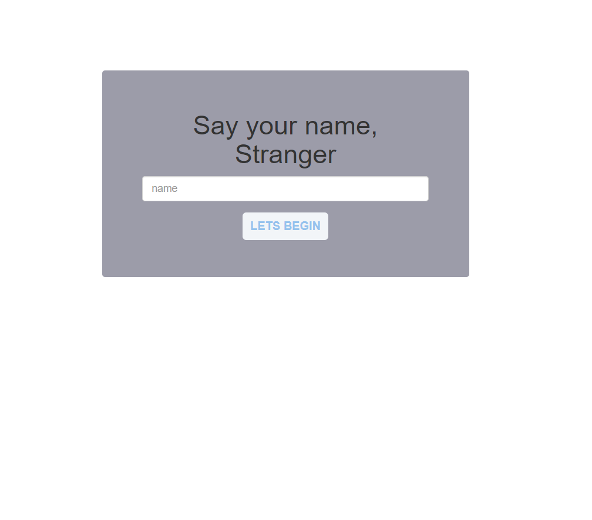
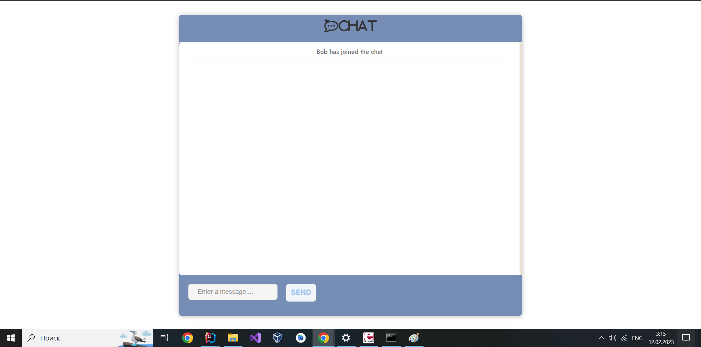
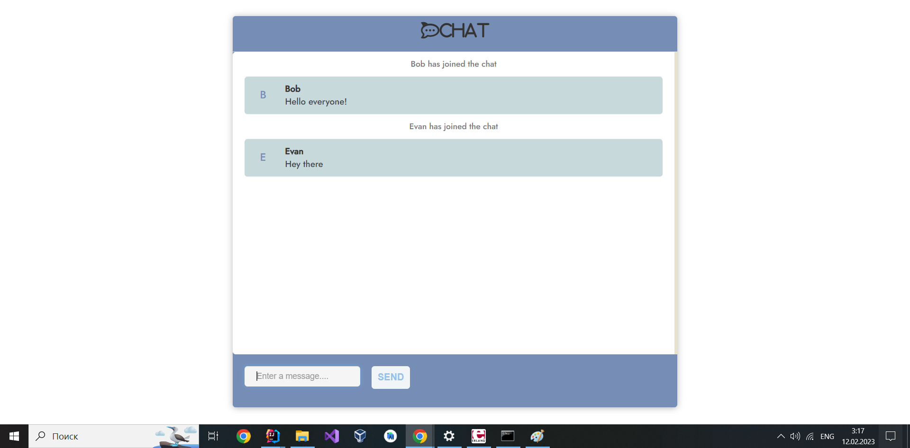

# ChatApplication
Spring boot websocket backend and HTML/CSS client

Server:
    - Spring boot Websocket Application + STOMP TCP RabbitMQ(Erlang) Brocker

Client
    - UI Client: HTML+CSS+JS
        1. Welcome banner + login(name)
        2. Dialogue page

## UI screens

To start:
- Turn on Erlang server
- Turn on RabbitMQ:
    - cd /path/to/rabbit/mq/sbin
    - ./path/to/rabbit/mq/sbin\ rabbitmq-server start
- For Windows: Enable RabbitMQ management:
    - ./path/to/rabbit/mq/sbin\ rabbitmq-plugins.bat enable rabbitmq_management
- Go to RabbitMQ console by https://localhost:15672
 
